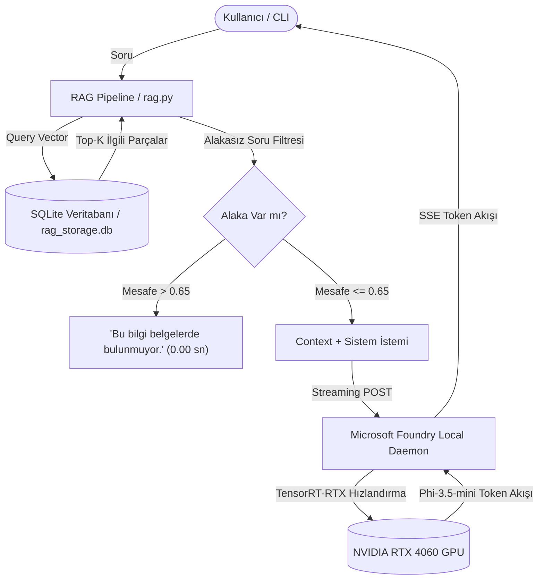

# Local RAG AI Assistant with Microsoft Foundry Local

Bu proje, **Microsoft Summer School** kapsamında geliştirilmiş; sıfır bulut bağımlılığıyla (%100 çevrimdışı) çalışan, gizlilik odaklı ve yerel donanım hızlandırmalı (NVIDIA RTX GPU) bir **Retrieval-Augmented Generation (RAG)** asistanıdır.

Kullanıcı sorularını yerel belgelerden (`.txt`) arayarak doğrular ve **Microsoft Foundry Local** üzerinden çalışan yerel dil modeli (**Phi-3.5-mini**) ile anlık olarak yanıtlar.

---

## 🏛️ Mimari Tasarım

Sistem 4 temel katmandan oluşur ve tamamı tek bir yerel bilgisayarda çalışır:



---

## ⚙️ Teknoloji Yığını

| Katman | Teknoloji | Açıklama |
| :--- | :--- | :--- |
| **Dil Modeli (LLM)** | **Microsoft Foundry Local + Phi-3.5-mini** | 2.1 GB boyutunda, NVIDIA TensorRT-RTX ile GPU bellek hızlandırmalı yerel model. |
| **Veri Tabanı** | **SQLite (`sqlite3`)** | Sıfır sunucu kurulumu, tek dosya (`rag_storage.db`), JSON formatında saklanan embedding vektörleri. |
| **Embedding Modeli** | `paraphrase-multilingual-MiniLM-L12-v2` + ONNX Runtime | Türkçe ve çok dilli metinler için 384 boyutlu, hızlı açılan CPU vektör üretici. |
| **Retrieval Yöntemi** | **Normalize Kosinüs Benzerliği** | Vektör matrisi nokta çarpımı ile sub-milisaniye (15–20 ms) hızında en yakın parça seçimi. |
| **Kullanıcı Arayüzü** | **Konsol / CLI (`main.py`)** | Gerçek zamanlı token akışı (streaming) ve etkileşimli sohbet döngüsü. |
| **Test & Değerlendirme**| `evaluate.py` + `evaluation_questions.json` | Doğruluk ve gecikme sürelerini ölçen uçtan uca test çerçevesi. |

---

## 🚀 Performans ve Donanım Optimizasyonu

Proje geliştirme sürecinde CPU çalışmasından kaynaklanan gecikmeler analiz edilmiş ve **NVIDIA GeForce RTX 4060 Laptop GPU** hızlandırmasına geçilmiştir:

| Metrik | Önceki Durum (`phi-4-mini` CPU) | Optimize Edilmiş Durum (`phi-3.5-mini` RTX 4060 GPU) | Kazanç |
| :--- | :--- | :--- | :--- |
| **Model Boyutu & Cihaz** | 4.8 GB / CPU | 2.1 GB / NVIDIA RTX 4060 GPU | **Donanım Hızlandırma** |
| **Cevap Üretim Süresi** | **36 – 53 saniye** | **1.4 – 2.8 saniye** | **~25 Kat Hızlanma ⚡** |
| **Retrieval Süresi** | 35 – 45 ms (ChromaDB) | **15 – 35 ms (Saf SQLite)** | **Daha Hafif & Sıfır Bağımlılık** |
| **Alakasız Soru Reddi** | 37 – 53 saniye bekleme | **0.00 saniye (Anında)** | **Gereksiz Hesaplama Engellendi** |
| **Retrieval Doğruluğu** | %100 (5/5) | **%100 (7/7)** | **Tam İlgili Parça Tespiti** |
| **Cevap Doğruluğu** | %42.9 (3/7) | **%100 (9/9)** | **Kusursuz Model Çıktısı 🎯** |

---

## 📂 Dosya Yapısı

```text
Local RAG AI Assistant/
├── docs/                      # 10 adet bilimsel biyoinformatik makalesi
│   ├── 01_dna_ve_nukleik_asitlerin_temelleri.txt
│   ├── 02_pcr_ve_dna_amplifikasyonu.txt
│   ├── 03_sanger_zincir_sonlandirma_dizileme.txt
│   ├── 04_yeni_nesil_dizileme_ngs_teknolojileri.txt
│   ├── 05_ucuncu_nesil_uzun_okuma_teknolojileri.txt
│   ├── 06_crispr_cas9_ve_genom_duzenleme.txt
│   ├── 07_dizi_hizalama_ve_blast_algoritmasi.txt
│   ├── 08_varyant_analizi_ve_kanser_genomigi.txt
│   ├── 09_metagenomik_ve_mikrobiyom_analizi.txt
│   └── 10_biyoinformatik_veritabanlari_ve_araclari.txt
├── ingest.py                  # Belgeleri okuma, parçalama ve SQLite'a vektör kaydı
├── onnx_embedding.py          # ONNX Runtime embedding adaptörü
├── models/                    # Yerel ONNX modeli ve tokenizer
├── rag.py                     # SQLite vektör araması, alaka kontrolü ve Foundry streaming
├── main.py                    # Kullanıcı dostu etkileşimli CLI sohbet döngüsü
├── evaluate.py                # Otomatik test ve süre ölçüm aracı
├── evaluation_questions.json  # 9 adet test vakası (cevaplanabilir ve cevaplanamaz)
├── evaluation_report.json     # Test sonuçları ve doğruluk raporu (%100 başarı)
├── requirements.txt           # Temiz Python bağımlılık listesi (4 paket)
└── rag_storage.db             # SQLite veritabanı dosyası (10 belge, 84 parça)
```

---

## 🛠️ Kurulum ve Çalıştırma

### 1. Gereksinimlerin Yüklenmesi
```bash
pip install -r requirements.txt
```

### 2. Foundry Local Servisinin ve Modelin Hazırlanması
Foundry Local kurulu değilse Windows Terminal üzerinden yükleyin:
```powershell
winget install Microsoft.FoundryLocal
```

Modeli GPU hızlandırmasıyla önbelleğe alıp başlatın:
```bash
foundry model download phi-3.5-mini
foundry server start --port 52268 --idle-timeout 0
foundry model load phi-3.5-mini
```

### 3. Asistanı Başlatma
```bash
python main.py
```
> Program başladığında belgeleri otomatik olarak kontrol eder, değişiklik varsa SQLite veritabanını günceller ve sohbeti başlatır.

### 4. Değerlendirme Testini Çalıştırma
Sistemin arama başarısını ve yanıt sürelerini ölçmek için:
```bash
python evaluate.py --with-llm
```

---

## 🛡️ Sorumlu Yapay Zeka (Responsible AI) Prensipleri

1. **Halüsinasyon Engelleme:** Model yalnızca `<context>` etiketleri içindeki kanıtlanabilir bilgileri kullanır; kendi genel bilgisini eklemez.
2. **Erken Reddetme (Early Rejection):** Sorulan soru belgelerle örtüşmüyorsa (kosinüs mesafesi > 0.65), model çalıştırılmadan anında `Bu bilgi belgelerde bulunmuyor.` cevabı döner.
3. **Kaynak Şeffaflığı:** Üretilen her yanıtın sonunda `[Kaynak: dosya_adı, Parça: no]` şeklinde alıntı bilgisi yer alır.
